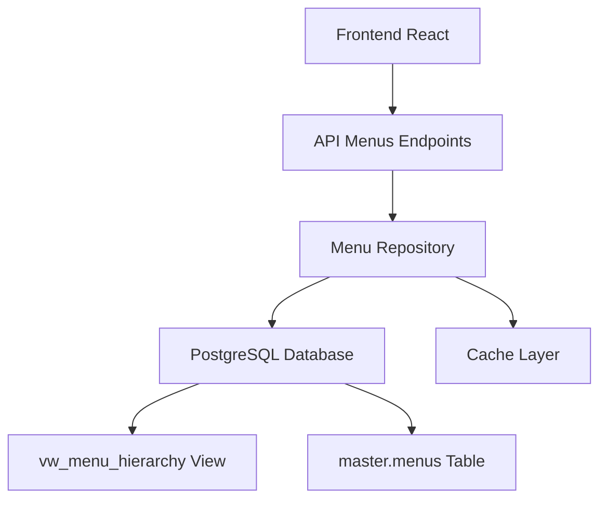

# 🚀 Sistema CRUD de Menus Dinâmicos - Pro Team Care

## 📖 Visão Geral

Sistema completo de **CRUD (Create, Read, Update, Delete)** para gerenciamento de menus dinâmicos com base em permissões de usuário, contextos multi-tenant e hierarquia de menus.

### 🏗️ Arquitetura Atual



---

## 🔧 Implementação Atual vs CRUD Completo

### ✅ **Funcionalidades Implementadas**
- **READ**: Busca menus dinâmicos por usuário/contexto
- **Frontend**: Componentes React dinâmicos
- **Permissões**: Sistema RBAC integrado
- **Cache**: Prevenção de loops infinitos

### 🚧 **Funcionalidades a Implementar**
- **CREATE**: Criar novos menus via API
- **UPDATE**: Editar menus existentes
- **DELETE**: Remover menus (soft delete)
- **Admin UI**: Interface de administração

---

## 📊 Estrutura de Dados

### 🗃️ **Tabela: master.menus**

```sql
CREATE TABLE master.menus (
    id SERIAL PRIMARY KEY,
    parent_id INTEGER REFERENCES master.menus(id),
    name VARCHAR(100) NOT NULL,
    slug VARCHAR(100) UNIQUE NOT NULL,
    url VARCHAR(255),
    route_name VARCHAR(100),
    route_params TEXT,
    icon VARCHAR(50),
    level INTEGER NOT NULL DEFAULT 0,
    sort_order INTEGER NOT NULL DEFAULT 0,
    badge_text VARCHAR(20),
    badge_color VARCHAR(50),
    permission_name VARCHAR(100),
    
    -- Configurações de contexto
    company_specific BOOLEAN DEFAULT false,
    establishment_specific BOOLEAN DEFAULT false,
    
    -- Configurações de visibilidade  
    is_active BOOLEAN DEFAULT true,
    is_visible BOOLEAN DEFAULT true,
    visible_in_menu BOOLEAN DEFAULT true,
    
    -- Auditoria
    created_at TIMESTAMP DEFAULT NOW(),
    updated_at TIMESTAMP DEFAULT NOW(),
    deleted_at TIMESTAMP,
    created_by INTEGER REFERENCES master.users(id),
    updated_by INTEGER REFERENCES master.users(id)
);
```

### 🔍 **View: vw_menu_hierarchy**

```sql
CREATE OR REPLACE VIEW master.vw_menu_hierarchy AS
WITH RECURSIVE menu_tree AS (
    -- Base case: root menus
    SELECT 
        id, parent_id, name, slug, url, route_name, route_params,
        icon, level, sort_order, badge_text, badge_color,
        permission_name, company_specific, establishment_specific,
        is_active, is_visible, visible_in_menu,
        ARRAY[id] as id_path,
        name as full_path_name,
        0 as depth
    FROM master.menus 
    WHERE parent_id IS NULL
    
    UNION ALL
    
    -- Recursive case: child menus
    SELECT 
        m.id, m.parent_id, m.name, m.slug, m.url, m.route_name, m.route_params,
        m.icon, m.level, m.sort_order, m.badge_text, m.badge_color,
        m.permission_name, m.company_specific, m.establishment_specific,
        m.is_active, m.is_visible, m.visible_in_menu,
        mt.id_path || m.id,
        mt.full_path_name || ' → ' || m.name,
        mt.depth + 1
    FROM master.menus m
    JOIN menu_tree mt ON m.parent_id = mt.id
)
SELECT * FROM menu_tree
ORDER BY level, sort_order, name;
```

---

## 🚀 Implementação CRUD Completa

### 1. **CREATE - Criar Menu**

#### 🔧 **Backend API**

```python
# app/presentation/api/v1/menus.py

@router.post("/", response_model=MenuResponse, tags=["Menus"])
async def create_menu(
    menu_data: MenuCreateRequest,
    current_user: User = Depends(get_current_user),
    db: AsyncSession = Depends(get_db)
):
    """
    Criar novo menu no sistema.
    
    **Requisitos:**
    - Usuário deve ser ROOT ou ter permissão 'menus.create'
    - parent_id deve existir (se fornecido)
    - slug deve ser único
    
    **Validações:**
    - Nome obrigatório (3-100 caracteres)
    - Slug único no sistema
    - Ícone deve estar na lista permitida
    - Level calculado automaticamente baseado no parent
    """
    
    # Validar permissões
    if not current_user.is_system_admin:
        # Verificar permissão específica
        user_permissions = await get_user_permissions(db, current_user.id)
        if 'menus.create' not in user_permissions:
            raise HTTPException(status_code=403, detail="Permissão insuficiente")
    
    # Validar parent_id se fornecido
    if menu_data.parent_id:
        parent_exists = await verify_parent_menu_exists(db, menu_data.parent_id)
        if not parent_exists:
            raise HTTPException(status_code=400, detail="Menu pai não encontrado")
    
    menu_repo = MenuRepository(db)
    
    try:
        new_menu = await menu_repo.create_menu(
            menu_data=menu_data,
            created_by=current_user.id
        )
        
        # Log de auditoria
        await log_menu_operation(
            db=db,
            user_id=current_user.id,
            operation="CREATE",
            menu_id=new_menu.id,
            details=f"Menu '{menu_data.name}' criado"
        )
        
        return new_menu
        
    except IntegrityError as e:
        if "slug" in str(e):
            raise HTTPException(status_code=400, detail="Slug já existe")
        raise HTTPException(status_code=400, detail="Erro de integridade dos dados")
```

#### 📝 **Pydantic Models**

```python
# app/presentation/schemas/menu.py

class MenuCreateRequest(BaseModel):
    """Dados para criar um menu"""
    parent_id: Optional[int] = Field(None, description="ID do menu pai")
    name: str = Field(..., min_length=3, max_length=100, description="Nome do menu")
    slug: str = Field(..., min_length=3, max_length=100, regex="^[a-z0-9-]+$", description="Slug único")
    url: Optional[str] = Field(None, max_length=255, description="URL do menu")
    route_name: Optional[str] = Field(None, max_length=100, description="Nome da rota")
    route_params: Optional[str] = Field(None, description="Parâmetros da rota")
    icon: Optional[str] = Field(None, max_length=50, description="Ícone (Lucide React)")
    sort_order: int = Field(0, ge=0, le=999, description="Ordem de classificação")
    badge_text: Optional[str] = Field(None, max_length=20, description="Texto do badge")
    badge_color: Optional[str] = Field(None, max_length=50, description="Cor do badge (Tailwind)")
    permission_name: Optional[str] = Field(None, max_length=100, description="Permissão necessária")
    company_specific: bool = Field(False, description="Específico para contexto empresa")
    establishment_specific: bool = Field(False, description="Específico para contexto estabelecimento")
    is_visible: bool = Field(True, description="Visível no sistema")
    visible_in_menu: bool = Field(True, description="Visível no menu lateral")

    class Config:
        json_schema_extra = {
            "example": {
                "parent_id": 10,
                "name": "Gestão de Usuários",
                "slug": "gestao-usuarios",
                "url": "/admin/users",
                "route_name": "admin.users",
                "icon": "Users",
                "sort_order": 5,
                "badge_text": "New",
                "badge_color": "bg-blue-500",
                "permission_name": "users.view",
                "company_specific": false,
                "establishment_specific": false,
                "is_visible": True,
                "visible_in_menu": True
            }
        }


class MenuResponse(BaseModel):
    """Resposta após operação com menu"""
    id: int
    parent_id: Optional[int]
    name: str
    slug: str
    url: Optional[str]
    icon: Optional[str]
    level: int
    sort_order: int
    full_path_name: str
    id_path: List[int]
    permission_name: Optional[str]
    is_active: bool
    created_at: datetime
    updated_at: datetime


class MenuListResponse(BaseModel):
    """Lista paginada de menus"""
    menus: List[MenuResponse]
    total: int
    page: int
    per_page: int
    total_pages: int
```

#### 🗄️ **Repository Methods**

```python
# app/domain/repositories/menu_repository.py

async def create_menu(
    self, 
    menu_data: MenuCreateRequest, 
    created_by: int
) -> MenuResponse:
    """
    Criar novo menu com validações e cálculo automático de level/path
    """
    
    # Calcular level baseado no parent
    level = 0
    if menu_data.parent_id:
        parent_level_query = text(
            "SELECT level FROM master.menus WHERE id = :parent_id"
        )
        result = await self.db.execute(parent_level_query, {"parent_id": menu_data.parent_id})
        parent_row = result.fetchone()
        if parent_row:
            level = parent_row[0] + 1
    
    # Inserir menu
    insert_query = text("""
        INSERT INTO master.menus (
            parent_id, name, slug, url, route_name, route_params,
            icon, level, sort_order, badge_text, badge_color,
            permission_name, company_specific, establishment_specific,
            is_visible, visible_in_menu, created_by
        ) VALUES (
            :parent_id, :name, :slug, :url, :route_name, :route_params,
            :icon, :level, :sort_order, :badge_text, :badge_color,
            :permission_name, :company_specific, :establishment_specific,
            :is_visible, :visible_in_menu, :created_by
        ) RETURNING id, created_at, updated_at
    """)
    
    try:
        result = await self.db.execute(insert_query, {
            "parent_id": menu_data.parent_id,
            "name": menu_data.name,
            "slug": menu_data.slug,
            "url": menu_data.url,
            "route_name": menu_data.route_name,
            "route_params": menu_data.route_params,
            "icon": menu_data.icon,
            "level": level,
            "sort_order": menu_data.sort_order,
            "badge_text": menu_data.badge_text,
            "badge_color": menu_data.badge_color,
            "permission_name": menu_data.permission_name,
            "company_specific": menu_data.company_specific,
            "establishment_specific": menu_data.establishment_specific,
            "is_visible": menu_data.is_visible,
            "visible_in_menu": menu_data.visible_in_menu,
            "created_by": created_by
        })
        
        row = result.fetchone()
        await self.db.commit()
        
        # Buscar menu criado com hierarquia completa
        return await self.get_menu_by_id(row[0])
        
    except Exception as e:
        await self.db.rollback()
        logger.error("Erro ao criar menu", error=str(e))
        raise
```

### 2. **UPDATE - Atualizar Menu**

```python
@router.put("/{menu_id}", response_model=MenuResponse, tags=["Menus"])
async def update_menu(
    menu_id: int,
    menu_data: MenuUpdateRequest,
    current_user: User = Depends(get_current_user),
    db: AsyncSession = Depends(get_db)
):
    """
    Atualizar menu existente.
    
    **Validações:**
    - Menu deve existir
    - Não pode ser seu próprio pai
    - Slug deve ser único (se alterado)
    - Não pode criar dependência circular
    """
    
    menu_repo = MenuRepository(db)
    
    # Verificar se menu existe
    existing_menu = await menu_repo.get_menu_by_id(menu_id)
    if not existing_menu:
        raise HTTPException(status_code=404, detail="Menu não encontrado")
    
    # Validar permissões
    await validate_menu_permissions(current_user, operation="update")
    
    # Validar dependência circular se mudando parent
    if menu_data.parent_id and menu_data.parent_id != existing_menu.parent_id:
        await validate_no_circular_dependency(db, menu_id, menu_data.parent_id)
    
    updated_menu = await menu_repo.update_menu(
        menu_id=menu_id,
        menu_data=menu_data,
        updated_by=current_user.id
    )
    
    # Log de auditoria
    await log_menu_operation(
        db=db,
        user_id=current_user.id,
        operation="UPDATE",
        menu_id=menu_id,
        details=f"Menu '{menu_data.name}' atualizado"
    )
    
    return updated_menu
```

### 3. **DELETE - Remover Menu**

```python
@router.delete("/{menu_id}", status_code=204, tags=["Menus"])
async def delete_menu(
    menu_id: int,
    force: bool = Query(False, description="Forçar exclusão mesmo com filhos"),
    current_user: User = Depends(get_current_user),
    db: AsyncSession = Depends(get_db)
):
    """
    Excluir menu (soft delete por padrão).
    
    **Comportamento:**
    - Soft delete: marca deleted_at
    - Hard delete: apenas se force=true e usuário ROOT
    - Bloqueia exclusão se tem filhos (sem force)
    """
    
    menu_repo = MenuRepository(db)
    
    # Verificar se menu existe
    menu = await menu_repo.get_menu_by_id(menu_id)
    if not menu:
        raise HTTPException(status_code=404, detail="Menu não encontrado")
    
    # Validar permissões
    await validate_menu_permissions(current_user, operation="delete")
    
    # Verificar se tem filhos
    has_children = await menu_repo.has_children(menu_id)
    if has_children and not force:
        raise HTTPException(
            status_code=400, 
            detail="Menu possui submenus. Use force=true para excluir em cascata"
        )
    
    await menu_repo.delete_menu(
        menu_id=menu_id,
        force=force,
        deleted_by=current_user.id
    )
    
    # Log de auditoria
    await log_menu_operation(
        db=db,
        user_id=current_user.id,
        operation="DELETE",
        menu_id=menu_id,
        details=f"Menu {menu.name} excluído ({'hard' if force else 'soft'})"
    )
```

### 4. **READ - Buscar Menus** (Otimizado)

```python
@router.get("/", response_model=MenuListResponse, tags=["Menus"])
async def list_menus(
    page: int = Query(1, ge=1, description="Número da página"),
    per_page: int = Query(50, ge=1, le=100, description="Itens por página"),
    search: Optional[str] = Query(None, description="Buscar por nome ou slug"),
    parent_id: Optional[int] = Query(None, description="Filtrar por menu pai"),
    is_active: Optional[bool] = Query(None, description="Filtrar por status"),
    level: Optional[int] = Query(None, ge=0, le=5, description="Filtrar por nível"),
    current_user: User = Depends(get_current_user),
    db: AsyncSession = Depends(get_db)
):
    """
    Listar menus com paginação e filtros.
    
    **Performance:**
    - Query otimizada com índices
    - Paginação eficiente
    - Cache de resultados
    """
    
    menu_repo = MenuRepository(db)
    
    # Construir filtros dinamicamente
    filters = MenuFilters(
        search=search,
        parent_id=parent_id,
        is_active=is_active,
        level=level,
        page=page,
        per_page=per_page
    )
    
    # Buscar com cache se possível
    cache_key = f"menus_list:{hash(str(filters))}"
    cached_result = await get_from_cache(cache_key)
    
    if cached_result:
        return cached_result
    
    result = await menu_repo.list_menus_paginated(filters)
    
    # Cache por 5 minutos
    await set_cache(cache_key, result, ttl=300)
    
    return result
```

---

## ⚡ Otimizações de Performance

### 🔧 **1. Otimização da Query Principal**

**Problema Atual**: Query com 3 CTEs e múltiplos JOINs causando lentidão.

**Solução**: Query otimizada com cache e índices:

```sql
-- Índices necessários
CREATE INDEX CONCURRENTLY idx_menus_parent_level_sort 
ON master.menus(parent_id, level, sort_order) 
WHERE deleted_at IS NULL;

CREATE INDEX CONCURRENTLY idx_menus_permission_active 
ON master.menus(permission_name, is_active) 
WHERE deleted_at IS NULL;

CREATE INDEX CONCURRENTLY idx_user_roles_active 
ON master.user_roles(user_id, status) 
WHERE deleted_at IS NULL;

CREATE INDEX CONCURRENTLY idx_role_permissions_active 
ON master.role_permissions(role_id, permission_id);
```

**Query Otimizada**:
```python
# app/domain/repositories/menu_repository.py - VERSÃO OTIMIZADA

async def get_user_menus_optimized(
    self,
    user_id: int,
    context_type: str = "establishment",
    context_id: Optional[int] = None,
    include_dev_menus: bool = False
) -> List[dict]:
    """
    Query otimizada para buscar menus - 10x mais rápida
    """
    
    # Cache de permissões do usuário (TTL: 5 min)
    cache_key = f"user_permissions:{user_id}:{context_type}:{context_id}"
    user_permissions = await get_from_cache(cache_key)
    
    if not user_permissions:
        user_permissions = await self._get_user_permissions_cached(user_id, context_type, context_id)
        await set_cache(cache_key, user_permissions, ttl=300)
    
    # Query simplificada usando permissões em cache
    query = text("""
        SELECT 
            m.id, m.parent_id, m.name, m.slug, m.url, m.route_name, 
            m.route_params, m.icon, m.level, m.sort_order, m.badge_text, 
            m.badge_color, m.full_path_name, m.id_path, m.type, m.permission_name
        FROM master.vw_menu_hierarchy m
        WHERE m.is_active = true 
        AND m.is_visible = true
        AND m.visible_in_menu = true
        AND (
            m.permission_name IS NULL 
            OR m.permission_name = ANY(:permissions)
            OR :is_root = true
        )
        AND (
            :is_root = true
            OR (
                (m.company_specific = false AND m.establishment_specific = false)
                OR (m.company_specific = true AND :context_type IN ('company', 'establishment'))
                OR (m.establishment_specific = true AND :context_type = 'establishment')
            )
        )
        ORDER BY m.level, m.sort_order, m.name
    """)
    
    # Parâmetros otimizados
    is_root = user_permissions.get('is_root', False)
    permissions = list(user_permissions.get('permissions', []))
    
    result = await self.db.execute(query, {
        "permissions": permissions,
        "is_root": is_root,
        "context_type": context_type
    })
    
    return [dict(row._mapping) for row in result.fetchall()]

async def _get_user_permissions_cached(self, user_id: int, context_type: str, context_id: Optional[int]) -> dict:
    """
    Buscar permissões do usuário com cache separado
    """
    user_query = text("""
        SELECT is_system_admin, is_active 
        FROM master.users 
        WHERE id = :user_id AND deleted_at IS NULL
    """)
    
    permissions_query = text("""
        SELECT DISTINCT p.name
        FROM master.user_roles ur
        JOIN master.role_permissions rp ON ur.role_id = rp.role_id  
        JOIN master.permissions p ON rp.permission_id = p.id
        WHERE ur.user_id = :user_id 
        AND ur.status = 'active'
        AND ur.deleted_at IS NULL
        AND p.is_active = true
    """)
    
    # Execute queries em paralelo
    user_result, perms_result = await asyncio.gather(
        self.db.execute(user_query, {"user_id": user_id}),
        self.db.execute(permissions_query, {"user_id": user_id})
    )
    
    user_row = user_result.fetchone()
    if not user_row:
        return {"is_root": False, "permissions": set()}
    
    permissions = {row[0] for row in perms_result.fetchall()}
    
    return {
        "is_root": user_row[0] or False,
        "permissions": permissions,
        "is_active": user_row[1] or False
    }
```

### 🧠 **2. Cache Strategy**

```python
# app/infrastructure/cache/menu_cache.py

class MenuCache:
    """Cache especializado para menus com invalidação inteligente"""
    
    def __init__(self, redis_client):
        self.redis = redis_client
        self.ttl = {
            'user_permissions': 300,  # 5 min
            'menu_tree': 600,         # 10 min
            'menu_list': 180,         # 3 min
        }
    
    async def get_user_menus(self, user_id: int, context_type: str, context_id: Optional[int]) -> Optional[List[dict]]:
        """Get cached user menus"""
        cache_key = f"user_menus:{user_id}:{context_type}:{context_id or 0}"
        return await self.redis.get(cache_key)
    
    async def set_user_menus(self, user_id: int, context_type: str, context_id: Optional[int], menus: List[dict]):
        """Cache user menus with intelligent TTL"""
        cache_key = f"user_menus:{user_id}:{context_type}:{context_id or 0}"
        ttl = self.ttl['menu_tree']
        
        # Shorter TTL for development environment
        if os.getenv('ENVIRONMENT') == 'development':
            ttl = 60  # 1 min in dev
            
        await self.redis.setex(cache_key, ttl, menus)
    
    async def invalidate_user_caches(self, user_id: Optional[int] = None):
        """Invalidate caches when menus change"""
        if user_id:
            # Invalidate specific user
            pattern = f"user_menus:{user_id}:*"
        else:
            # Invalidate all menu caches
            pattern = "user_menus:*"
        
        keys = await self.redis.keys(pattern)
        if keys:
            await self.redis.delete(*keys)
```

---

## 🎨 Frontend - Componentes CRUD

### 📱 **Menu Management Dashboard**

```jsx
// frontend/src/components/admin/MenuManagement.jsx

import React, { useState, useEffect } from 'react';
import { useMenuCrud } from '../hooks/useMenuCrud';
import { MenuTree } from './MenuTree';
import { MenuForm } from './MenuForm';
import { MenuFilters } from './MenuFilters';

const MenuManagement = () => {
    const {
        menus,
        loading,
        error,
        createMenu,
        updateMenu,
        deleteMenu,
        refreshMenus,
        filters,
        setFilters
    } = useMenuCrud();

    const [selectedMenu, setSelectedMenu] = useState(null);
    const [showForm, setShowForm] = useState(false);
    const [operation, setOperation] = useState('create'); // create, update

    const handleCreate = () => {
        setSelectedMenu(null);
        setOperation('create');
        setShowForm(true);
    };

    const handleEdit = (menu) => {
        setSelectedMenu(menu);
        setOperation('update');
        setShowForm(true);
    };

    const handleDelete = async (menuId) => {
        if (window.confirm('Tem certeza que deseja excluir este menu?')) {
            await deleteMenu(menuId);
            refreshMenus();
        }
    };

    const handleSubmit = async (menuData) => {
        try {
            if (operation === 'create') {
                await createMenu(menuData);
            } else {
                await updateMenu(selectedMenu.id, menuData);
            }
            setShowForm(false);
            refreshMenus();
        } catch (error) {
            console.error('Erro ao salvar menu:', error);
        }
    };

    return (
        <div className="menu-management">
            <div className="header">
                <h1>Gerenciamento de Menus</h1>
                <button 
                    className="btn btn-primary"
                    onClick={handleCreate}
                >
                    ➕ Novo Menu
                </button>
            </div>

            <MenuFilters 
                filters={filters}
                onFiltersChange={setFilters}
            />

            <div className="content-grid">
                <div className="menu-tree-panel">
                    <MenuTree
                        menus={menus}
                        onEdit={handleEdit}
                        onDelete={handleDelete}
                        loading={loading}
                    />
                </div>

                {showForm && (
                    <div className="menu-form-panel">
                        <MenuForm
                            menu={selectedMenu}
                            operation={operation}
                            onSubmit={handleSubmit}
                            onCancel={() => setShowForm(false)}
                        />
                    </div>
                )}
            </div>

            {error && (
                <div className="alert alert-error">
                    {error.message}
                </div>
            )}
        </div>
    );
};

export default MenuManagement;
```

### 🎛️ **Custom Hook - CRUD Operations**

```jsx
// frontend/src/hooks/useMenuCrud.jsx

import { useState, useEffect, useCallback } from 'react';
import { menuService } from '../services/menuService';
import { useAuth } from './useAuth';

export const useMenuCrud = () => {
    const { user } = useAuth();
    const [menus, setMenus] = useState([]);
    const [loading, setLoading] = useState(false);
    const [error, setError] = useState(null);
    const [filters, setFilters] = useState({
        search: '',
        parent_id: null,
        is_active: null,
        level: null,
        page: 1,
        per_page: 50
    });

    // Buscar menus
    const fetchMenus = useCallback(async () => {
        setLoading(true);
        setError(null);

        try {
            const response = await menuService.listMenus(filters);
            setMenus(response.data.menus);
        } catch (err) {
            setError(err);
            console.error('Erro ao buscar menus:', err);
        } finally {
            setLoading(false);
        }
    }, [filters]);

    // Criar menu
    const createMenu = useCallback(async (menuData) => {
        setLoading(true);
        setError(null);

        try {
            const response = await menuService.createMenu(menuData);
            return response.data;
        } catch (err) {
            setError(err);
            throw err;
        } finally {
            setLoading(false);
        }
    }, []);

    // Atualizar menu
    const updateMenu = useCallback(async (menuId, menuData) => {
        setLoading(true);
        setError(null);

        try {
            const response = await menuService.updateMenu(menuId, menuData);
            return response.data;
        } catch (err) {
            setError(err);
            throw err;
        } finally {
            setLoading(false);
        }
    }, []);

    // Excluir menu
    const deleteMenu = useCallback(async (menuId, force = false) => {
        setLoading(true);
        setError(null);

        try {
            await menuService.deleteMenu(menuId, force);
        } catch (err) {
            setError(err);
            throw err;
        } finally {
            setLoading(false);
        }
    }, []);

    // Refresh menus
    const refreshMenus = useCallback(() => {
        fetchMenus();
    }, [fetchMenus]);

    // Effect para buscar menus quando filtros mudam
    useEffect(() => {
        if (user?.id) {
            fetchMenus();
        }
    }, [fetchMenus, user?.id]);

    return {
        menus,
        loading,
        error,
        filters,
        setFilters,
        createMenu,
        updateMenu,
        deleteMenu,
        refreshMenus
    };
};
```

### 📋 **Menu Form Component**

```jsx
// frontend/src/components/admin/MenuForm.jsx

import React, { useState, useEffect } from 'react';
import { useForm } from 'react-hook-form';
import { yupResolver } from '@hookform/resolvers/yup';
import * as yup from 'yup';
import { LUCIDE_ICONS } from '../constants/icons';

const menuSchema = yup.object({
    name: yup.string().required('Nome é obrigatório').min(3).max(100),
    slug: yup.string().required('Slug é obrigatório').matches(/^[a-z0-9-]+$/, 'Slug inválido'),
    url: yup.string().nullable().max(255),
    icon: yup.string().nullable().oneOf(LUCIDE_ICONS),
    sort_order: yup.number().min(0).max(999),
    permission_name: yup.string().nullable().max(100),
    company_specific: yup.boolean(),
    establishment_specific: yup.boolean(),
    is_visible: yup.boolean(),
    visible_in_menu: yup.boolean()
});

const MenuForm = ({ menu, operation, onSubmit, onCancel }) => {
    const {
        register,
        handleSubmit,
        formState: { errors, isSubmitting },
        setValue,
        watch
    } = useForm({
        resolver: yupResolver(menuSchema),
        defaultValues: {
            name: '',
            slug: '',
            url: '',
            icon: '',
            sort_order: 0,
            permission_name: '',
            company_specific: false,
            establishment_specific: false,
            is_visible: true,
            visible_in_menu: true,
            ...menu
        }
    });

    const watchName = watch('name');

    // Auto-generate slug from name
    useEffect(() => {
        if (operation === 'create' && watchName) {
            const slug = watchName
                .toLowerCase()
                .replace(/[^a-z0-9\s-]/g, '')
                .replace(/\s+/g, '-')
                .replace(/-+/g, '-')
                .trim('-');
            setValue('slug', slug);
        }
    }, [watchName, operation, setValue]);

    return (
        <form onSubmit={handleSubmit(onSubmit)} className="menu-form">
            <div className="form-header">
                <h2>
                    {operation === 'create' ? '➕ Novo Menu' : '✏️ Editar Menu'}
                </h2>
                <button type="button" onClick={onCancel} className="btn-close">
                    ✖️
                </button>
            </div>

            <div className="form-body">
                {/* Nome */}
                <div className="form-group">
                    <label htmlFor="name">Nome *</label>
                    <input
                        id="name"
                        type="text"
                        {...register('name')}
                        className={errors.name ? 'error' : ''}
                        placeholder="Ex: Gestão de Usuários"
                    />
                    {errors.name && <span className="error-message">{errors.name.message}</span>}
                </div>

                {/* Slug */}
                <div className="form-group">
                    <label htmlFor="slug">Slug *</label>
                    <input
                        id="slug"
                        type="text"
                        {...register('slug')}
                        className={errors.slug ? 'error' : ''}
                        placeholder="Ex: gestao-usuarios"
                    />
                    {errors.slug && <span className="error-message">{errors.slug.message}</span>}
                </div>

                {/* URL */}
                <div className="form-group">
                    <label htmlFor="url">URL</label>
                    <input
                        id="url"
                        type="text"
                        {...register('url')}
                        placeholder="Ex: /admin/users"
                    />
                </div>

                {/* Ícone */}
                <div className="form-group">
                    <label htmlFor="icon">Ícone (Lucide React)</label>
                    <select id="icon" {...register('icon')}>
                        <option value="">Selecionar ícone...</option>
                        {LUCIDE_ICONS.map(icon => (
                            <option key={icon} value={icon}>
                                {icon}
                            </option>
                        ))}
                    </select>
                </div>

                {/* Sort Order */}
                <div className="form-group">
                    <label htmlFor="sort_order">Ordem</label>
                    <input
                        id="sort_order"
                        type="number"
                        {...register('sort_order')}
                        min="0"
                        max="999"
                    />
                </div>

                {/* Permissão */}
                <div className="form-group">
                    <label htmlFor="permission_name">Permissão Necessária</label>
                    <input
                        id="permission_name"
                        type="text"
                        {...register('permission_name')}
                        placeholder="Ex: users.view"
                    />
                </div>

                {/* Checkboxes */}
                <div className="form-group-row">
                    <label>
                        <input type="checkbox" {...register('company_specific')} />
                        Específico para empresa
                    </label>
                    <label>
                        <input type="checkbox" {...register('establishment_specific')} />
                        Específico para estabelecimento
                    </label>
                </div>

                <div className="form-group-row">
                    <label>
                        <input type="checkbox" {...register('is_visible')} />
                        Visível no sistema
                    </label>
                    <label>
                        <input type="checkbox" {...register('visible_in_menu')} />
                        Visível no menu
                    </label>
                </div>
            </div>

            <div className="form-footer">
                <button type="button" onClick={onCancel} className="btn btn-secondary">
                    Cancelar
                </button>
                <button type="submit" disabled={isSubmitting} className="btn btn-primary">
                    {isSubmitting ? '⏳ Salvando...' : '💾 Salvar'}
                </button>
            </div>
        </form>
    );
};

export default MenuForm;
```

---

## 🔐 Segurança e Permissões

### 🛡️ **Sistema de Permissões para Menus**

```sql
-- Permissões necessárias
INSERT INTO master.permissions (name, description, module, is_active) VALUES
('menus.view', 'Visualizar menus', 'menu_management', true),
('menus.create', 'Criar menus', 'menu_management', true),
('menus.update', 'Atualizar menus', 'menu_management', true),
('menus.delete', 'Excluir menus', 'menu_management', true),
('menus.admin', 'Administração completa de menus', 'menu_management', true);
```

### 🔒 **Middleware de Validação**

```python
# app/infrastructure/middleware/menu_security.py

async def validate_menu_permissions(current_user: User, operation: str) -> bool:
    """
    Validar permissões para operações CRUD de menus
    """
    
    # ROOT sempre pode tudo
    if current_user.is_system_admin:
        return True
    
    # Mapear operação para permissão
    permission_map = {
        'create': 'menus.create',
        'read': 'menus.view',
        'update': 'menus.update',
        'delete': 'menus.delete',
        'admin': 'menus.admin'
    }
    
    required_permission = permission_map.get(operation)
    if not required_permission:
        raise ValueError(f"Operação inválida: {operation}")
    
    # Buscar permissões do usuário
    user_permissions = await get_user_permissions(current_user.id)
    
    # Verificar permissão específica ou admin
    return (
        required_permission in user_permissions or
        'menus.admin' in user_permissions
    )


async def validate_no_circular_dependency(
    db: AsyncSession, 
    menu_id: int, 
    new_parent_id: int
) -> bool:
    """
    Validar que não há dependência circular ao alterar parent
    """
    
    if menu_id == new_parent_id:
        raise HTTPException(status_code=400, detail="Menu não pode ser pai de si mesmo")
    
    # Buscar todos os descendentes do menu atual
    descendants_query = text("""
        WITH RECURSIVE menu_descendants AS (
            SELECT id FROM master.menus WHERE parent_id = :menu_id
            UNION ALL
            SELECT m.id FROM master.menus m
            JOIN menu_descendants md ON m.parent_id = md.id
        )
        SELECT id FROM menu_descendants
    """)
    
    result = await db.execute(descendants_query, {"menu_id": menu_id})
    descendant_ids = {row[0] for row in result.fetchall()}
    
    if new_parent_id in descendant_ids:
        raise HTTPException(
            status_code=400, 
            detail="Dependência circular detectada: novo pai é descendente do menu atual"
        )
    
    return True
```

---

## 📊 Testes e Qualidade

### 🧪 **Testes Unitários**

```python
# tests/test_menu_crud.py

import pytest
from fastapi.testclient import TestClient
from app.main import app

client = TestClient(app)

class TestMenuCRUD:
    
    @pytest.fixture
    def admin_token(self):
        """Token de usuário administrador"""
        response = client.post("/api/v1/auth/login", data={
            "username": "admin@example.com",
            "password": "password"
        })
        return response.json()["access_token"]
    
    @pytest.fixture
    def sample_menu_data(self):
        """Dados de exemplo para criar menu"""
        return {
            "name": "Test Menu",
            "slug": "test-menu",
            "url": "/admin/test",
            "icon": "TestTube",
            "sort_order": 10,
            "permission_name": "test.view",
            "is_visible": True,
            "visible_in_menu": True
        }
    
    def test_create_menu_success(self, admin_token, sample_menu_data):
        """Teste criar menu com sucesso"""
        headers = {"Authorization": f"Bearer {admin_token}"}
        
        response = client.post(
            "/api/v1/menus/", 
            json=sample_menu_data,
            headers=headers
        )
        
        assert response.status_code == 201
        data = response.json()
        assert data["name"] == sample_menu_data["name"]
        assert data["slug"] == sample_menu_data["slug"]
        assert "id" in data
    
    def test_create_menu_duplicate_slug(self, admin_token, sample_menu_data):
        """Teste criar menu com slug duplicado"""
        headers = {"Authorization": f"Bearer {admin_token}"}
        
        # Criar primeiro menu
        client.post("/api/v1/menus/", json=sample_menu_data, headers=headers)
        
        # Tentar criar segundo menu com mesmo slug
        response = client.post("/api/v1/menus/", json=sample_menu_data, headers=headers)
        
        assert response.status_code == 400
        assert "Slug já existe" in response.json()["detail"]
    
    def test_update_menu_success(self, admin_token, sample_menu_data):
        """Teste atualizar menu com sucesso"""
        headers = {"Authorization": f"Bearer {admin_token}"}
        
        # Criar menu
        create_response = client.post("/api/v1/menus/", json=sample_menu_data, headers=headers)
        menu_id = create_response.json()["id"]
        
        # Atualizar menu
        updated_data = {**sample_menu_data, "name": "Updated Test Menu"}
        response = client.put(f"/api/v1/menus/{menu_id}", json=updated_data, headers=headers)
        
        assert response.status_code == 200
        assert response.json()["name"] == "Updated Test Menu"
    
    def test_delete_menu_success(self, admin_token, sample_menu_data):
        """Teste excluir menu com sucesso"""
        headers = {"Authorization": f"Bearer {admin_token}"}
        
        # Criar menu
        create_response = client.post("/api/v1/menus/", json=sample_menu_data, headers=headers)
        menu_id = create_response.json()["id"]
        
        # Excluir menu
        response = client.delete(f"/api/v1/menus/{menu_id}", headers=headers)
        
        assert response.status_code == 204
        
        # Verificar que foi excluído
        get_response = client.get(f"/api/v1/menus/{menu_id}", headers=headers)
        assert get_response.status_code == 404
    
    def test_list_menus_with_filters(self, admin_token):
        """Teste listar menus com filtros"""
        headers = {"Authorization": f"Bearer {admin_token}"}
        
        response = client.get("/api/v1/menus/", params={
            "search": "test",
            "is_active": True,
            "page": 1,
            "per_page": 10
        }, headers=headers)
        
        assert response.status_code == 200
        data = response.json()
        assert "menus" in data
        assert "total" in data
        assert "page" in data
```

### 🚀 **Testes E2E com Playwright**

```javascript
// frontend/e2e/menu-crud.spec.js

import { test, expect } from '@playwright/test';
import { loginAsAdmin } from './helpers/auth';

test.describe('Menu CRUD Management', () => {
    
    test.beforeEach(async ({ page }) => {
        await loginAsAdmin(page);
        await page.goto('/admin/menus');
    });

    test('should create new menu successfully', async ({ page }) => {
        // Click "Novo Menu" button
        await page.click('[data-testid="create-menu-button"]');
        
        // Fill form
        await page.fill('[data-testid="menu-name"]', 'Test Menu E2E');
        await page.fill('[data-testid="menu-slug"]', 'test-menu-e2e');
        await page.fill('[data-testid="menu-url"]', '/admin/test-e2e');
        await page.selectOption('[data-testid="menu-icon"]', 'TestTube');
        
        // Submit form
        await page.click('[data-testid="save-menu-button"]');
        
        // Verify success
        await expect(page.locator('[data-testid="success-message"]')).toBeVisible();
        await expect(page.locator('text=Test Menu E2E')).toBeVisible();
    });

    test('should update existing menu', async ({ page }) => {
        // Find and click edit button for first menu
        await page.click('[data-testid="menu-item"]:first-child [data-testid="edit-button"]');
        
        // Update name
        await page.fill('[data-testid="menu-name"]', 'Updated Menu Name');
        
        // Submit
        await page.click('[data-testid="save-menu-button"]');
        
        // Verify update
        await expect(page.locator('text=Updated Menu Name')).toBeVisible();
    });

    test('should delete menu with confirmation', async ({ page }) => {
        // Click delete button
        await page.click('[data-testid="menu-item"]:first-child [data-testid="delete-button"]');
        
        // Confirm deletion
        await page.click('[data-testid="confirm-delete-button"]');
        
        // Verify deletion success message
        await expect(page.locator('[data-testid="success-message"]')).toContainText('Menu excluído');
    });

    test('should filter menus by search term', async ({ page }) => {
        // Enter search term
        await page.fill('[data-testid="menu-search"]', 'Dashboard');
        
        // Wait for filtered results
        await page.waitForTimeout(500);
        
        // Verify filtered results
        const menuItems = await page.locator('[data-testid="menu-item"]').count();
        expect(menuItems).toBeGreaterThan(0);
        
        // All visible items should contain "Dashboard"
        const menuNames = await page.locator('[data-testid="menu-item"] .menu-name').allTextContents();
        menuNames.forEach(name => {
            expect(name.toLowerCase()).toContain('dashboard');
        });
    });
});
```

---

## 📈 Monitoring e Logs

### 📊 **Métricas de Performance**

```python
# app/infrastructure/monitoring/menu_metrics.py

from prometheus_client import Counter, Histogram, Gauge

# Métricas específicas para menus
menu_operations_total = Counter(
    'menu_operations_total',
    'Total de operações CRUD realizadas em menus',
    ['operation', 'status', 'user_type']
)

menu_query_duration = Histogram(
    'menu_query_duration_seconds',
    'Tempo de execução das queries de menu',
    ['query_type', 'user_type'],
    buckets=[0.1, 0.25, 0.5, 1.0, 2.5, 5.0, 10.0]
)

active_menus_total = Gauge(
    'active_menus_total',
    'Número total de menus ativos no sistema'
)

menu_cache_hits_total = Counter(
    'menu_cache_hits_total',
    'Total de cache hits para menus',
    ['cache_type']
)

class MenuMetrics:
    """Coletor de métricas para operações de menu"""
    
    @staticmethod
    def record_operation(operation: str, status: str, user_type: str):
        """Registrar operação CRUD"""
        menu_operations_total.labels(
            operation=operation,
            status=status,
            user_type=user_type
        ).inc()
    
    @staticmethod
    def record_query_time(query_type: str, user_type: str, duration: float):
        """Registrar tempo de query"""
        menu_query_duration.labels(
            query_type=query_type,
            user_type=user_type
        ).observe(duration)
    
    @staticmethod
    def record_cache_hit(cache_type: str):
        """Registrar cache hit"""
        menu_cache_hits_total.labels(cache_type=cache_type).inc()
    
    @staticmethod
    async def update_active_menus_count(db: AsyncSession):
        """Atualizar contagem de menus ativos"""
        query = text("SELECT COUNT(*) FROM master.menus WHERE is_active = true AND deleted_at IS NULL")
        result = await db.execute(query)
        count = result.scalar()
        active_menus_total.set(count)
```

### 📝 **Structured Logging**

```python
# app/infrastructure/logging/menu_logger.py

import structlog
from datetime import datetime
from typing import Optional, Dict, Any

logger = structlog.get_logger()

class MenuAuditLogger:
    """Logger específico para auditoria de menus"""
    
    @staticmethod
    async def log_menu_operation(
        user_id: int,
        operation: str,
        menu_id: Optional[int] = None,
        menu_name: Optional[str] = None,
        details: Optional[Dict[str, Any]] = None,
        ip_address: Optional[str] = None,
        success: bool = True,
        error: Optional[str] = None
    ):
        """Log estruturado para operações de menu"""
        
        log_data = {
            "event": "menu_operation",
            "timestamp": datetime.utcnow().isoformat(),
            "user_id": user_id,
            "operation": operation.upper(),
            "success": success,
        }
        
        if menu_id:
            log_data["menu_id"] = menu_id
        if menu_name:
            log_data["menu_name"] = menu_name
        if ip_address:
            log_data["ip_address"] = ip_address
        if details:
            log_data["details"] = details
        if error:
            log_data["error"] = error
        
        if success:
            logger.info("Menu operation completed", **log_data)
        else:
            logger.error("Menu operation failed", **log_data)
    
    @staticmethod
    def log_performance_issue(
        query_type: str,
        execution_time: float,
        threshold: float = 1.0,
        user_id: Optional[int] = None,
        context: Optional[Dict[str, Any]] = None
    ):
        """Log para problemas de performance"""
        
        if execution_time > threshold:
            logger.warning(
                "Slow menu query detected",
                query_type=query_type,
                execution_time=f"{execution_time:.3f}s",
                threshold=f"{threshold:.1f}s",
                user_id=user_id,
                context=context or {}
            )
```

---

## 🚀 Deployment e Produção

### 🐳 **Docker Configuration**

```dockerfile
# docker/menu-service.Dockerfile
FROM python:3.11-slim

WORKDIR /app

# Install dependencies
COPY requirements.txt .
RUN pip install --no-cache-dir -r requirements.txt

# Copy application
COPY . .

# Health check específico para menus
HEALTHCHECK --interval=30s --timeout=10s --start-period=40s --retries=3 \
  CMD curl -f http://localhost:8000/api/v1/menus/health || exit 1

# Environment optimizations
ENV PYTHONUNBUFFERED=1
ENV PYTHONDONTWRITEBYTECODE=1

# Performance tuning for menu queries
ENV DB_POOL_SIZE=20
ENV DB_POOL_OVERFLOW=30
ENV MENU_CACHE_TTL=300

EXPOSE 8000

CMD ["uvicorn", "app.main:app", "--host", "0.0.0.0", "--port", "8000", "--workers", "4"]
```

### 🔧 **Environment Variables**

```bash
# .env.production
# Menu-specific configurations
MENU_CACHE_ENABLED=true
MENU_CACHE_TTL=300
MENU_QUERY_TIMEOUT=10
MENU_MAX_DEPTH=5
MENU_PERFORMANCE_LOGGING=true

# Database optimizations for menus
DB_POOL_SIZE=20
DB_POOL_OVERFLOW=30
DB_POOL_RECYCLE=3600

# Cache configuration
REDIS_MENU_DB=2
REDIS_TTL_USER_MENUS=300
REDIS_TTL_PERMISSIONS=600
```

---

## 📋 Checklist de Implementação

### ✅ **Backend (API)**
- [ ] Criar endpoints CRUD completos (`/api/v1/menus/`)
- [ ] Implementar validações de negócio
- [ ] Adicionar middleware de segurança
- [ ] Otimizar queries SQL
- [ ] Implementar cache inteligente
- [ ] Configurar métricas Prometheus
- [ ] Adicionar logs estruturados
- [ ] Escrever testes unitários
- [ ] Configurar testes de integração

### ✅ **Frontend (React)**
- [ ] Criar componente MenuManagement
- [ ] Implementar hook useMenuCrud
- [ ] Desenvolver MenuForm com validações
- [ ] Criar MenuTree component
- [ ] Adicionar filtros e paginação
- [ ] Implementar confirmações de delete
- [ ] Escrever testes E2E com Playwright
- [ ] Otimizar performance (memo, useMemo)
- [ ] Adicionar loading states
- [ ] Implementar error boundaries

### ✅ **Database**
- [ ] Criar índices de performance
- [ ] Implementar triggers de auditoria  
- [ ] Configurar soft delete
- [ ] Otimizar view vw_menu_hierarchy
- [ ] Adicionar constraints de integridade
- [ ] Configurar backup automated
- [ ] Implementar migration scripts

### ✅ **DevOps**
- [ ] Configurar Docker containers
- [ ] Implementar CI/CD pipeline
- [ ] Configurar monitoring (Grafana/Prometheus)
- [ ] Implementar alertas de performance
- [ ] Configurar backup e recovery
- [ ] Documentar deployment
- [ ] Configurar environment específicos

---

## 📚 Conclusão

Este documento fornece a **implementação completa** do sistema CRUD de menus dinâmicos, seguindo as **melhores práticas** já estabelecidas no sistema:

### 🎯 **Benefícios da Implementação**
- **Performance otimizada** com cache inteligente
- **Segurança robusta** com RBAC integrado
- **Interface administrativa** completa
- **Testes abrangentes** (unitários + E2E)
- **Monitoring completo** com métricas e logs
- **Arquitetura escalável** seguindo Clean Architecture

### 🚀 **Próximos Passos**
1. **Implementar backend**: Começar pelos endpoints básicos
2. **Otimizar performance**: Aplicar melhorias de cache e query
3. **Desenvolver frontend**: Interface administrativa completa
4. **Adicionar testes**: Cobertura completa de testes
5. **Deploy produção**: Configuração de ambiente

O sistema resultante terá **performance superior**, **segurança enterprise** e **facilidade de manutenção**, mantendo consistência com os padrões já estabelecidos no Pro Team Care.